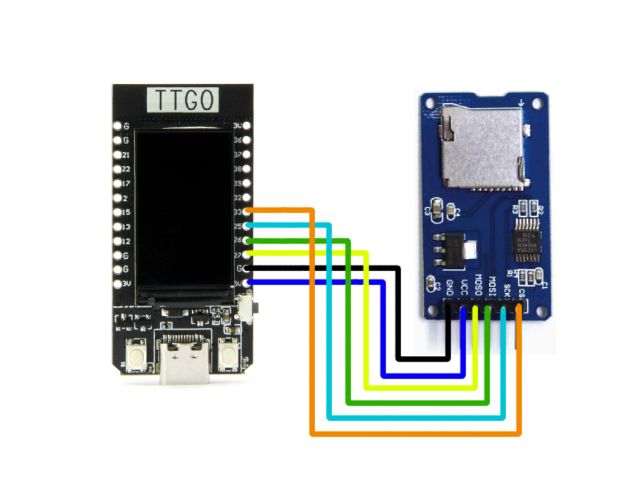

# TTGO_ESP32_DisplayJpeg_SDcard_CompleteEdition
Full How to Show Image in SD card by Eps32 TTGO


### 1.Required parts
* TTGO T-Display ESP32 
* SPI SD Memory Module (6 pins)
* Cable wire (optional)

### 2.Wire connection
Following this diagram



### 3.Copy example.jpg to your SD card
> File "example.jpg" is in this github repository. This Step is not important just make sure for the fisrt time testing.

### 4.Put This code in to Arduino IDE

```c
#include <SPI.h>
#include <TFT_eSPI.h>
TFT_eSPI tft = TFT_eSPI();
#include <JPEGDecoder.h>
#include <ArduinoJson.h>
#include "FS.h"
#include "SD.h"

#define minimum(a,b)     (((a) < (b)) ? (a) : (b))
uint32_t icount = 0;

#define ENABLE_SPI_SDCARD
#ifdef ENABLE_SPI_SDCARD

SPIClass SDSPI(HSPI);

#define MY_CS       33               //You can custom connect pins with any pin you want.
#define MY_SCLK     25
#define MY_MISO     27
#define MY_MOSI     26

void setupSDCard()
{
    SDSPI.begin(MY_SCLK, MY_MISO, MY_MOSI, MY_CS);
    //Assuming use of SPI SD card
    if (!SD.begin(MY_CS, SDSPI)) {
        Serial.println("Card Mount Failed");
    } else {
       }
}
#else
#define setupSDCard()
#endif

void setup() {
    Serial.begin(115200);
    Serial.println("Start");
    setupSDCard();
    tft.begin();
}

void loop() {

  tft.setRotation(2);  // portrait
  tft.fillScreen(random(0xFFFF));
  drawSdJpeg("/example.jpg", 0, 0);     // This draws a jpeg pulled off the SD Card
  delay(2000);
}

//####################################################################################################
// Draw a JPEG on the TFT pulled from SD Card
//####################################################################################################
// xpos, ypos is top left corner of plotted image
void drawSdJpeg(const char *filename, int xpos, int ypos) {

  // Open the named file (the Jpeg decoder library will close it)
  File jpegFile = SD.open( filename, FILE_READ);  // or, file handle reference for SD library
 
  if ( !jpegFile ) {
    Serial.print("ERROR: File \""); Serial.print(filename); Serial.println ("\" not found!");
    return;
  }

  Serial.println("===========================");
  Serial.print("Drawing file: "); Serial.println(filename);
  Serial.println("===========================");

  // Use one of the following methods to initialise the decoder:
  bool decoded = JpegDec.decodeSdFile(jpegFile);  // Pass the SD file handle to the decoder,
  //bool decoded = JpegDec.decodeSdFile(filename);  // or pass the filename (String or character array)

  if (decoded) {
    // print information about the image to the serial port
    jpegInfo();
    // render the image onto the screen at given coordinates
    jpegRender(xpos, ypos);
  }
  else {
    Serial.println("Jpeg file format not supported!");
  }
}
//####################################################################################################
// Draw a JPEG on the TFT, images will be cropped on the right/bottom sides if they do not fit
//####################################################################################################
// This function assumes xpos,ypos is a valid screen coordinate. For convenience images that do not
// fit totally on the screen are cropped to the nearest MCU size and may leave right/bottom borders.
void jpegRender(int xpos, int ypos) {

  //jpegInfo(); // Print information from the JPEG file (could comment this line out)

  uint16_t *pImg;
  uint16_t mcu_w = JpegDec.MCUWidth;
  uint16_t mcu_h = JpegDec.MCUHeight;
  uint32_t max_x = JpegDec.width;
  uint32_t max_y = JpegDec.height;

  bool swapBytes = tft.getSwapBytes();
  tft.setSwapBytes(true);
  
  // Jpeg images are draw as a set of image block (tiles) called Minimum Coding Units (MCUs)
  // Typically these MCUs are 16x16 pixel blocks
  // Determine the width and height of the right and bottom edge image blocks
  uint32_t min_w = jpg_min(mcu_w, max_x % mcu_w);
  uint32_t min_h = jpg_min(mcu_h, max_y % mcu_h);

  // save the current image block size
  uint32_t win_w = mcu_w;
  uint32_t win_h = mcu_h;

  // record the current time so we can measure how long it takes to draw an image
  uint32_t drawTime = millis();

  // save the coordinate of the right and bottom edges to assist image cropping
  // to the screen size
  max_x += xpos;
  max_y += ypos;

  // Fetch data from the file, decode and display
  while (JpegDec.read()) {    // While there is more data in the file
    pImg = JpegDec.pImage ;   // Decode a MCU (Minimum Coding Unit, typically a 8x8 or 16x16 pixel block)

    // Calculate coordinates of top left corner of current MCU
    int mcu_x = JpegDec.MCUx * mcu_w + xpos;
    int mcu_y = JpegDec.MCUy * mcu_h + ypos;

    // check if the image block size needs to be changed for the right edge
    if (mcu_x + mcu_w <= max_x) win_w = mcu_w;
    else win_w = min_w;

    // check if the image block size needs to be changed for the bottom edge
    if (mcu_y + mcu_h <= max_y) win_h = mcu_h;
    else win_h = min_h;

    // copy pixels into a contiguous block
    if (win_w != mcu_w)
    {
      uint16_t *cImg;
      int p = 0;
      cImg = pImg + win_w;
      for (int h = 1; h < win_h; h++)
      {
        p += mcu_w;
        for (int w = 0; w < win_w; w++)
        {
          *cImg = *(pImg + w + p);
          cImg++;
        }
      }
    }
    // calculate how many pixels must be drawn
    uint32_t mcu_pixels = win_w * win_h;
    // draw image MCU block only if it will fit on the screen
    if (( mcu_x + win_w ) <= tft.width() && ( mcu_y + win_h ) <= tft.height())
      tft.pushImage(mcu_x, mcu_y, win_w, win_h, pImg);
    else if ( (mcu_y + win_h) >= tft.height())
      JpegDec.abort(); // Image has run off bottom of screen so abort decoding
  }
  tft.setSwapBytes(swapBytes);
  showTime(millis() - drawTime); // These lines are for sketch testing only
}
//####################################################################################################
// Print image information to the serial port (optional)
//####################################################################################################
// JpegDec.decodeFile(...) or JpegDec.decodeArray(...) must be called before this info is available!
void jpegInfo() {
  // Print information extracted from the JPEG file
  Serial.println("JPEG image info");
  Serial.println("===============");
  Serial.print("Width      :");
  Serial.println(JpegDec.width);
  Serial.print("Height     :");
  Serial.println(JpegDec.height);
  Serial.print("Components :");
  Serial.println(JpegDec.comps);
  Serial.print("MCU / row  :");
  Serial.println(JpegDec.MCUSPerRow);
  Serial.print("MCU / col  :");
  Serial.println(JpegDec.MCUSPerCol);
  Serial.print("Scan type  :");
  Serial.println(JpegDec.scanType);
  Serial.print("MCU width  :");
  Serial.println(JpegDec.MCUWidth);
  Serial.print("MCU height :");
  Serial.println(JpegDec.MCUHeight);
  Serial.println("===============");
  Serial.println("");
}
//####################################################################################################
// Show the execution time (optional)
//####################################################################################################
// WARNING: for UNO/AVR legacy reasons printing text to the screen with the Mega might not work for
// sketch sizes greater than ~70KBytes because 16 bit address pointers are used in some libraries.
// The Due will work fine with the HX8357_Due library.
void showTime(uint32_t msTime) {
  //tft.setCursor(0, 0);
  //tft.setTextFont(1);
  //tft.setTextSize(2);
  //tft.setTextColor(TFT_WHITE, TFT_BLACK);
  //tft.print(F(" JPEG drawn in "));
  //tft.print(msTime);
  //tft.println(F(" ms "));
  Serial.print(F(" JPEG drawn in "));
  Serial.print(msTime);
  Serial.println(F(" ms "));
}

```
[Spacial Thank "Bodmer" for this code Click here to go github repository](https://github.com/Bodmer/TFT_eSPI/tree/master/examples/Generic/ESP32_SDcard_jpeg)

### 5.Compile it and done.
Last but not lest. I create this repository because i spend 3 day to fix trouble of SPI SD card Connecting. I don't know how to connect right pins to Module. Any Document in website just give a code but don't teach how to connect or what library to use (I think a TTGO T-Display is kind a be specific it's mean small user small document). But anyway, it makes me know 4 way to show image in this device (bitmap , write .h file , read and show .jpg file , show image by url). You don't have to waste time. Enjoy your code.
 


